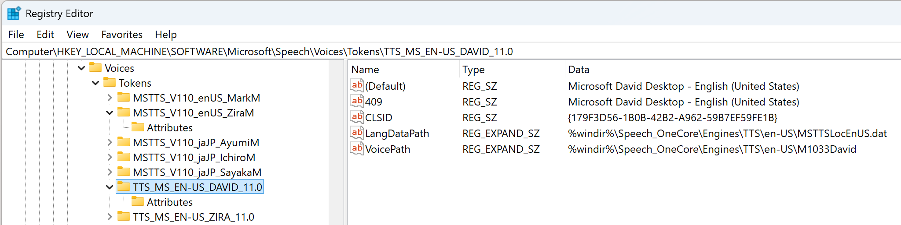
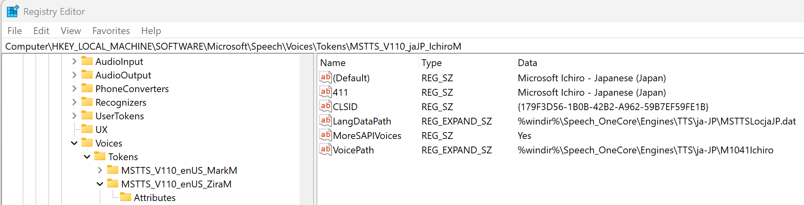

# MoreSAPIVoices


MoreSAPIVoices is a Windows console program to reversibly add OneCore voices to [SAPI 5](https://en.wikipedia.org/wiki/Microsoft_Speech_API) for text-to-speech programs that use SAPI 5, such as [Igor Pro 10](https://www.wavemetrics.com/products/igorpro) (for which ``MoreSAPIVoices`` was developed).

OneCore voices by default are not available in SAPI-based programs without informing SAPI about them by adding registry entries pointing to the OneCore voices, which are installed in a different registry location.

The Windows Speech Properties control panel shows both SAPI and OneCore voices without identifying which are SAPI and which are OneCore, but you can use RegEdit to examine installed voices. See [Registry Details for OneCore and SAPI Voices](#registry_details_for_onecore_and_sapi_voices).

##  Alternative to MoreSAPIVoices

[SAPI Unifier](https://github.com/Mahmood-Taghavi/SAPI_Unifier) by Mahmood Taghavi.

## Adding OneCore Voices to SAPI Applications

Running ``MoreSAPIVoices.exe`` without any parameters using the Command Prompt (cmd.exe) in Administrator mode copies registry entries from the OneCore voice registry keys to where SAPI applications look for installed voices.

As it copies the registry keys, it lists the OneCore voices it adds to SAPI:

```text
> MoreSAPIVoices
Adding OneCore voices to legacy SAPI voices, marking with MoreSAPIVoices = "Yes"...
Copied voice: MSTTS_V110_enUS_MarkM
Copied voice: MSTTS_V110_enUS_ZiraM
Copied voice: MSTTS_V110_jaJP_AyumiM
Copied voice: MSTTS_V110_jaJP_IchiroM
Copied voice: MSTTS_V110_jaJP_SayakaM
```

### Registry Details for OneCore and SAPI Voices

MoreSAPIVoices.exe without any parameters copies registry entries from:

```text
HKEY_LOCAL_MACHINE\SOFTWARE\Microsoft\Speech_OneCore\Voices\Tokens\*
```

to:

```text
HKEY_LOCAL_MACHINE\SOFTWARE\Microsoft\Speech\Voices\Tokens\*
```

and adds a ``MoreSAPIVoices=Yes`` registry entry to the copied voice entries so that ``MoreSAPIVoices`` knows which registry entries should be removed when ``MoreSAPIVoices uninstall`` is run.

For example, here are the default SAPI "David" voice's registry keys:



Notice that while the voice is installed in the ``Speech\Voices\`` tree used for SAPI voices, that the speech "engine" is actually in the OneCore directory.

Here are the registry keys for the OneCore Ichiro voice copied to the SAPI tree by ``MoreSAPIVoices``. Notice the ``MoreSAPIVoices`` key that was added to identify a SAPI voice that ``MoreSAPIVoices uninstall`` will remove.



Notice that the Ichiro voice is also a OneCore voice, but it is not by default installed in the SAPI registry tree.

``MoreSAPIVoices`` does not look at the Voice path to decide which voices to uninstall for that very reason: some standard SAPI voices are implemented with OneCore. That is why the presence of the added ``MoreSAPIVoices`` key is used to decide which registry entries to remove during uninstall.

### Why Are There Now Two Voices with the same name?

OneCore reimplements some voices from the older SAPI technology, using a slightly different voice name.

For example, if you have installed the Japanese Language Pack on a standard U.S. English Windows 10/11 operating system, there will be a SAPI ``Microsoft Zira - English (United States)`` voice and a OneCore ``Microsoft Zira Desktop - English (United States)`` voice.

They are implemented by different voice engines. The SAPI Zira Voice with Token ``TTS_MS_EN-US_ZIRA_11.0`` has:

``VoicePath = %SystemRoot%\Speech\Engines\TTS\en-US\M1033ZIR``

The OneCore Zira Voice with Token ``MSTTS_V110_enUS_ZiraM`` has:

``VoicePath = %windir%\Speech_OneCore\Engines\TTS\en-US\M1033Zira``

These look different enough to ``MoreSAPIVoices`` that it copies the "new" Zira's registry entries to the SAPI registry tree.

## Removing OneCore Voices from SAPI

When ``MoreSAPIVoices.exe uninstall`` is run, it lists the OneCore voices it removed from the SAPI registry keys:

```text
> MoreSAPIVoices uninstall

Restoring standard legacy SAPI voices by removing OneCore voices from SAPI...
Removed voice copy: MSTTS_V110_enUS_MarkM
Removed voice copy: MSTTS_V110_enUS_ZiraM
Removed voice copy: MSTTS_V110_jaJP_AyumiM
Removed voice copy: MSTTS_V110_jaJP_IchiroM
Removed voice copy: MSTTS_V110_jaJP_SayakaM
(No voices were removed from OneCore)
```

## License

This project is licensed under the [MIT License](https://opensource.org/licenses/MIT).  
See the [LICENSE](LICENSE) file for details.

## Disclaimer of Warranty

This software is provided "as is", without warranty of any kind, express or implied, including but not limited to the warranties of merchantability, fitness for a particular purpose, and noninfringement. In no event shall the authors or copyright holders be liable for any claim, damages, or other liability, whether in an action of contract, tort, or otherwise, arising from, out of, or in connection with the software or the use or other dealings in the software.
